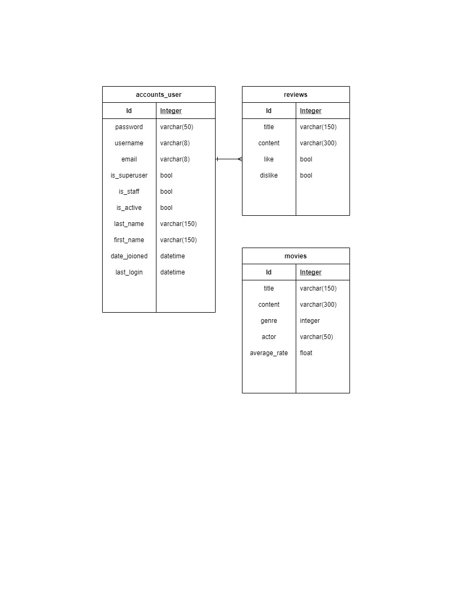
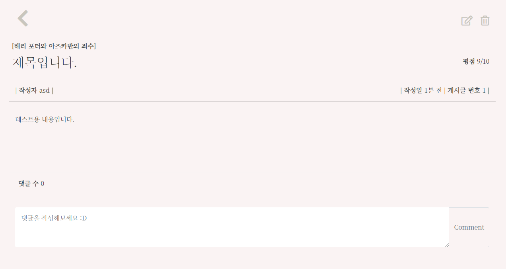
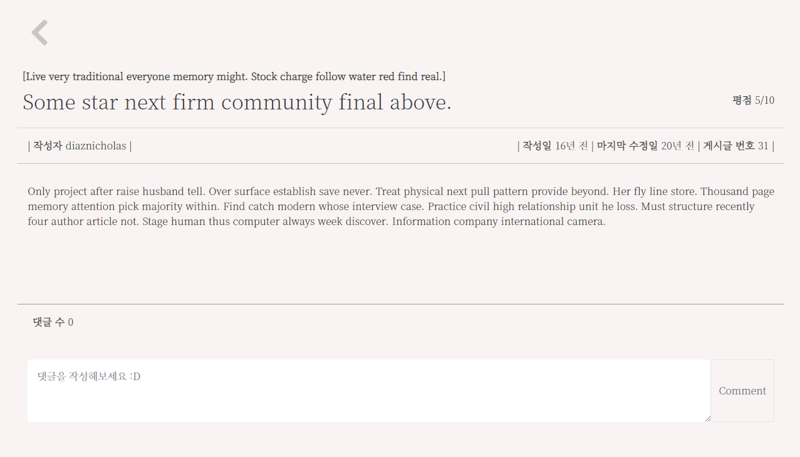
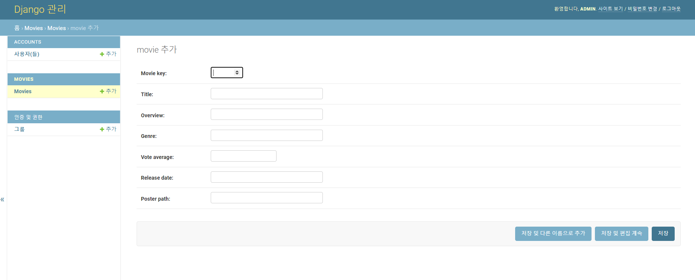

# README

# 목차

[0. 프로젝트 소개](#0-프로젝트-소개)

- [특징](#특징)
- [개발기간](#개발기간)
- [와이어프레임](#와이어프레임)
- [ERD](#erd)
- [컴포넌트 구조](#컴포넌트-구조)
- [폴더 구조](#폴더-구조)

[1. 실행 방법](#1-실행-방법)

[2. 개발 환경](#2-개발-환경)

[3. 기능](#3-기능)

- [회원가입](#회원가입)
- [로그인](#로그인)
- [Home(영화 조회)](#home영화-조회)
- [영화 상세 조회](#영화-상세-조회)
- [네비게이션 바](#네비게이션-바)
- [추천 알고리즘](#추천-알고리즘)
- [리뷰 조회](#리뷰-조회)
- [리뷰 작성](#리뷰-작성)
- [리뷰 상세 조회](#리뷰-상세-조회)
- [리뷰 수정, 삭제](#리뷰-수정-삭제)
- [댓글](#댓글)
- [관리자 페이지](#관리자-페이지)

[4. 역할](#4-역할)


# 0. 프로젝트 소개

**백지장(WhiteSheet)** 은 📽 TMDB api를 활용한 **영화 정보 기반 추천 서비스**와 👨‍👨‍👧‍👧 **커뮤니티 서비스** 를 제공하는 웹 플랫폼입니다.

## 특징

- 영화를 다양한 기준에 맞추어 확인할 수 있습니다!
  - 상영중 
    - 🔎 지금 개봉한 영화는 뭐가 있을까요?
  - 인기영화
    - 👩‍👩‍👧‍👧 집단 지성을 믿어봅시다!
  - 높은 평점
    - ✨ 고전부터 최신작까지, 최고의 영화들을 원한다면 이쪽!
  - 개봉 예정
    - 🧡 두근두근!

- 사용자의 로그에 맞추어 영화를 추천해줍니다!
  - 💘 관심있는 영화를 눌러보세요. 이 영화들도 좋아하실 겁니다!
  - 💨 다양한 영화를 누를수록 추천 서비스는 정교해집니다!
  - 💥 그냥 눌러봤을 뿐인데... 추천 영화가 망가졌다고요? 초기화 기능도 있습니다!
- 커뮤니티 서비스도 있어요!
  - 📃 게시글을 작성해서 영화에 대해 얘기를 나눠볼 수 있어요~
  - 🏓 댓글을 달아서 대화해봅시다~

## 개발기간

2021.05.20 ~ 2021.05.27

[Back](#목차)

## 와이어프레임


[Back](#목차)

## ERD



[Back](#목차)

## 컴포넌트 구조


[Back](#목차)

## 폴더 구조

- Front-End

```
final-pjt-front
├-node_modules(생략)
├-public
	├─favicon.ico
    ├─index.html
├-src
	├─assets
    ├─components
    │      MovieCard.vue
    │      MovieCardDetail.vue
    │
    ├─data
    │      index.js
    │
    ├─router
    │      index.js
    │
    ├─store
    │      index.js
    │
    └─views
        ├─accounts
        │      Login.vue
        │      LoginGoogle.vue
        │      Signup.vue
        │
        ├─movies
        │      Home.vue
        │
        └─reviews
                CreateReview.vue
                ReviewList.vue
                ReviewListDetail.vue

```

- Back-End

```
final-pjt-back
├-db.sqlite3
├-manage.py
├-requirements.txt
├-venv(생략)
├-accounts
	│  admin.py
    │  apps.py
    │  models.py
    │  serializers.py
    │  tests.py
    │  urls.py
    │  views.py
    │  __init__.py
    │
   	├─migrations
    │  │  0001_initial.py
    │  │  __init__.py
    │  │
    │  └─__pycache__
    │          0001_initial.cpython-38.pyc
    │          __init__.cpython-38.pyc
    │
    └─__pycache__
            admin.cpython-38.pyc
            apps.cpython-38.pyc
            models.cpython-38.pyc
            serializers.cpython-38.pyc
            urls.cpython-38.pyc
            views.cpython-38.pyc
            __init__.cpython-38.pyc
├-final_pjt_back
	│  asgi.py
    │  settings.py
    │  urls.py
    │  wsgi.py
    │  __init__.py
    │
    └─__pycache__
            settings.cpython-38.pyc
            urls.cpython-38.pyc
            wsgi.cpython-38.pyc
            __init__.cpython-38.pyc
├-movies
	│  admin.py
    │  apps.py
    │  models.py
    │  serializers.py
    │  tests.py
    │  urls.py
    │  views.py
    │  __init__.py
    │
    ├─migrations
    │  │  0001_initial.py
    │  │  0002_recommendation.py
    │  │  0003_alter_recommendation_user.py
    │  │  0004_alter_review_user.py
    │  │  0005_alter_comment_user.py
    │  │  0006_alter_comment_user.py
    │  │  0007_comment_username.py
    │  │  0008_alter_review_content.py
    │  │  0009_alter_comment_content.py
    │  │  0010_alter_review_content.py
    │  │  0011_alter_review_content.py
    │  │  0012_alter_review_content.py
    │  │  __init__.py
    │  │
    │  └─__pycache__
    │          0001_initial.cpython-38.pyc
    │          0002_recommendation.cpython-38.pyc
    │          0003_alter_recommendation_user.cpython-38.pyc
    │          0004_alter_review_user.cpython-38.pyc
    │          0005_alter_comment_user.cpython-38.pyc
    │          0006_alter_comment_user.cpython-38.pyc
    │          0007_comment_username.cpython-38.pyc
    │          0008_alter_review_content.cpython-38.pyc
    │          0009_alter_comment_content.cpython-38.pyc
    │          0010_alter_review_content.cpython-38.pyc
    │          0011_alter_review_content.cpython-38.pyc
    │          0012_alter_review_content.cpython-38.pyc
    │          __init__.cpython-38.pyc
    │
    └─__pycache__
            admin.cpython-38.pyc
            apps.cpython-38.pyc
            models.cpython-38.pyc
            serializers.cpython-38.pyc
            urls.cpython-38.pyc
            views.cpython-38.pyc
            __init__.cpython-38.pyc
```

[Back](#목차)


# 1. 실행 방법

**※ 주의할 점(Django-seed)**

 서버를 켜서 **Home** 에 먼저 접속한 후에 Django-seed를 실행해야 합니다.

 추천 알고리즘을 제대로 확인하기 위해서 우선 **API 통신을 통해 DB가 다 구성된 다음에 더미 데이터를 생성해야** 하기 때문에, API 호출을 실행하는 Home에 먼저 접속해야 합니다. (리뷰, 코멘트용 데이터)

 처음부터 Django-seed를 하면 DB에 저장된 영화 목록에도 더미 데이터가 반영되면서 추천 알고리즘을 통해 확인할 수 있는 영화 포스터가 보이지 않습니다. (Django-seed는 이미지는 생성하지 않기 때문)

```bash
-- 프론트엔드
cd final-pjt-front/
npm i
npm run serve

cd ..

cd final_pjt_back/
python manage.py migrate
python manage.py runserver
python manage.py seed movies --number=30
```

[Back](#목차)


# 2. 개발 환경

- 백엔드

  

- 프론트엔드

  


- 협업툴

  

  https://eastern-stork-d41.notion.site/8e5fd1ef8031498589bdbd91a9ba02b1

  - 진행상황 및 문서화

  https://www.notion.so/77ce1e668a524a50b041af04d0ee9591?v=3d028a3e38a84264bc1b722c790a8c98

[Back](#목차)


# 3. 기능

## 회원가입

- 로그인 되어 있지 않은 경우, Home 페이지 대신 회원가입 / 로그인 페이지가 나타납니다.

- DB에 같은 아이디가 있거나, 입력한 비밀번호와 비밀번호 확인의 입력값이 다르다면 회원가입에 실패합니다.


[Back](#목차)

## 로그인

- 로그인 한 유저만이 웹 서비스를 이용할 수 있습니다.

- DB에 아이디가 없거나 비밀번호가 틀렸을 시에는 로그인에 실패합니다.
  - 로그인 여부는 jwt 토큰을 통해 인증합니다.
- 소셜 로그인은 미완성 되었습니다.


[Back](#목차)

## Home(영화 조회)

- 원하는 기준에 따라 영화를 조회할 수 있습니다.

  - 상영중
  - 인기영화
  - 높은 평점
  - 개봉예정

- 영화를 선택하지 않고도 포스터와 시놉시스를 확인할 수 있습니다. (프리뷰)

- 무한 스크롤을 이용해 끊임없이 영화를 확인할 수 있습니다.

  ※ API 통신 환경에 따라 버벅일 수 있습니다.

- goTop 버튼으로 언제든 최상단으로 이동할 수 있습니다.


[Back](#목차)

## 영화 상세 조회

- 영화의 상세 정보를 확인할 수 있습니다.
  - 영화 아이디 (TMDB)
  - 영화 제목
  - 개봉일자
    - 현재 날짜로부터 몇 일 전에 개봉되었는지 알려줍니다.
    - 개봉 예정이라면 몇 일 후에 개봉될지 알려줍니다.
  - 소개
  - 평점 및 카운트
  - 인기도
- 뒤로가기 버튼을 누르면 영화 조회(Home) 페이지로 돌아갈 수 있습니다.


[Back](#목차)

## 네비게이션 바

- 상단에 위치한 네비게이션 바를 이용해 웹 서비스의 어디든 이동할 수 있습니다.
  - Vue의 라우터 링크로 구성하였습니다.
- Movie Recommender는 마우스 오버 시 추천 영화 목록의 포스터가 나타나며, TMDB에 포스터가 등록되지 않은 경우에는 영화의 제목만 나타납니다.


## 추천 알고리즘

- 최대 6개의 영화를 추천해줍니다.
- 네비게이션 바의 Movie Recommender 에 마우스 오버 시 나타납니다. 마우스 커서를 바깥으로 옮기면 사라집니다. 
- 포스터를 누르면 영화 디테일 페이지로 이동합니다.
- Reset 버튼을 누르면 추천된 영화 목록을 초기화할 수 있습니다.


### 동작 원리

- 영화를 클릭해서 디테일 페이지로 이동할 때마다 유저가 관심있어 하는 영화의 장르가 수집됩니다. 

- 해당 영화를 서버(Django)에서 분석하여 DB에 저장된 1000여개의 영화 중 유저가 좋아할만한 영화를 추천합니다.

  

- 영화를 클릭하면 해당 영화의 장르 정보가 문자열로 유저와 FK로 연결된 모델에 저장됩니다. 이 정보를 파싱해서 딕셔너리로 만든 후에 유저가 클릭한 영화의 장르별 빈도수를 계산합니다. 
- 한 영화의 장르는 여러개일 수 있기 때문에 유저가 선택한 영화의 총합과 장르의 빈도수는 같지 않을 수 있습니다.


- 장르의 빈도수가 높은 순으로 영화 DB를 필터링합니다. 필터링된 영화의 정보는 언제나 10개를 초과합니다.

- 필터링된 영화를 평점순으로 6개를 골라 클라이언트로 전송합니다.

 

- 유저가 추천 영화 초기화를 할 수도 있습니다. Django의 clear() 메소드를 사용하며, 이 경우 유저와 FK로 연결된 모델에서 유저 정보만 null로 바뀝니다. (모델 필드 중 user는 null=True 필수)
- 유저와의 연결고리가 사라졌을 뿐, DB에는 정보가 남아있기 때문에 익명으로 사용자 관심 정보를 수집, 분석할 때 유용할 것으로 생각됩니다.

[Back](#목차)

## 리뷰 조회

- 리뷰를 선택하지 않고도 리뷰 정보를 확인할 수 있습니다. (프리뷰)
  - 리뷰 내용
  - 작성자
  - 최초 작성 일시 (수정 일시는 표시되지 않음)
- 우상단에 있는 Review 버튼을 이용해 리뷰를 작성할 수 있습니다.


[Back](#목차)

## 리뷰 작성

- 리뷰를 작성할 수 있습니다.
- 영화 제목은 자동완성을 지원합니다.
- 평점은 1점부터 10점까지 선택이 가능합니다.
- 입력이 되지 않은 항목이 있을 경우 리뷰가 작성되지 않습니다.


[Back](#목차)


## 리뷰 상세 조회

- 리뷰를 보거나 댓글을 작성, 조회할 수 있습니다.



[Back](#목차)

## 리뷰 수정, 삭제

- 리뷰를 작성한 유저만이 수정, 삭제 권한을 가집니다.
- 제목, 내용, 평점을 수정할 수 있습니다.
- 영화 제목은 수정할 수 없습니다. 악의적으로 영화 리뷰를 조작할 수 있기 때문에 수정할 수 없도록 하였습니다.


- 리뷰 작성자가 아닌 경우 우상단에 수정, 삭제 아이콘이 보이지 않습니다.



[Back](#목차)

## 댓글

- 댓글을 작성한 사용자만이 댓글을 삭제할 수 있습니다.
- 댓글의 수를 확인할 수 있으며, 새로운 댓글은 뱃지 형태로 확인할 수 있습니다.
- 댓글을 작성한 사용자 이름과 작성 일자, 댓글 내용을 확인할 수 있습니다.


[Back](#목차)

## 관리자 페이지

- 관리자 권한의 유저만이 영화 등록 / 수정 / 삭제 권한을 가집니다.
- 관리자 권한의 유저만이 유저 관리 권한을 가집니다.



[Back](#목차)


# 4. 역할

- 이은총

  - 팀장

  - Full-Stack
  - Home(영화 조회)
  - 영화 추천
  - 리뷰 조회
  - 리뷰 작성

- 홍원기

  - Full-Stack
  - 영화 상세 조회
  - 리뷰 상세 조회
  - 리뷰 수정, 삭제
  - 댓글 작성, 삭제

- 이현두

  - Full-Stack
  - 회원가입
  - 로그인
  - 소셜 로그인

[Back](#목차)

